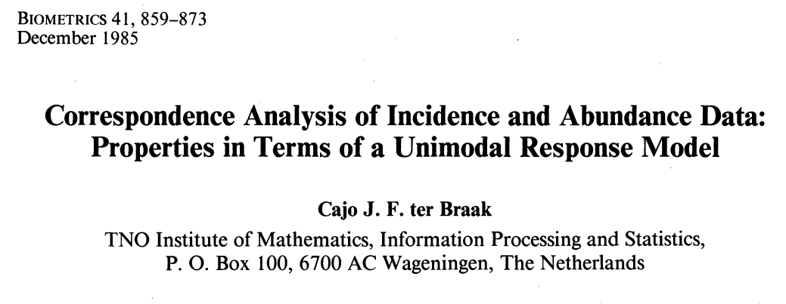
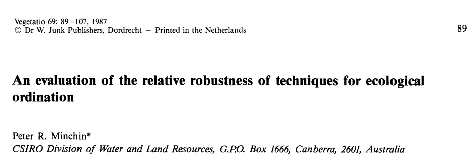
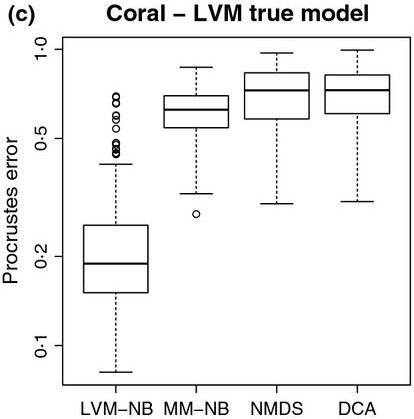
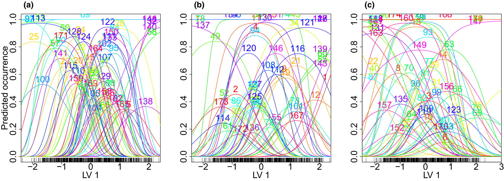

layout:true
<div class="my-footer"><div class="my-footer-nested-left">`r icons::icon_style(icons::fontawesome("twitter"),fill="white")`@vdVeenB</div>
<div class="my-footer-nested-right">`r icons::icon_style(icons::fontawesome("envelope"),fill="white")`bert.v.d.veen@ntnu.no </div></div>

---


<!--
2) Looking back: community ecology once was on the frontier, doing the quantitative push (see e.g., refs that say so; Austin 1985, Walker 2015 https://link.springer.com/article/10.1007/s11258-015-0467-7#Sec2, Ovaskainen & Abrego pp 30)
  - Ordination was one of the few methods available for multivariate techniques (OK, besides clusttering methods)
  - Was recognized by ter Braak and Gauch in the 80s, but computational power was missing (Warton, Walker)
  - These days, there are much more statistical methods available for multivariate analysis:
    - e.g., HMMs, Mixture models, V/MGLMs, GLLVMs, not to mention all kinds of network approaches from machine learning
    - Ordination is still most applied multivariate method in ecology (Ovaskainen & Abrego)
  - Now ordination is deemed descriptive: Ovaskainen and Abrego (pp), yet it is still a very useful tool for many ecologists
  - However, it is not "cool" anymore. But easy to understand and use.
  - ter Braak and prentice: many methods are heuristic but useful in practice.
3) In this presentation, I will make the point that ordination is/can be still quantitative. Yet development has stalled a little
  - many new flavors of existing techniques, but few new ones (ok, PRC and work by Yee) but it isn't adopted for some reason
  - This push comes from community ecology and is not recent (Jackson, hui, Boral, Warton)
  - Partly based on the JSDM crowd
  - partly because "classical methods" have been shown to be bad (distance metrics and such).
4) We go back a little. Jackson and the JSDM from Pollock (also mention their examples)
  - Has come from the intention to study "biotic interactions" and for binary data, i.e., to predict occurrence
  - However, cannot be inferred from JSDMs, yet they have on the rise! Ordination is neglected.
  - Ovaskainen connected the JSDM to proper ecological foundations
  - Warton et al. 2015: We are now entering a third phase in methods for multivariate analysis in ecology. This has been driven by the advent of sophisticated hierarchical modeling tools, a watershed for complex problems that arise in ecology 
  
5) I (with  others) have been working on the ordination side. Because correlation plots are useless
- Difference between JSDMs and Ordination? Spatial scale and crowd. Yet they are the same!
  - ordination has long since focussed not only on pres/ab, but also on measures of frequency
- Either how, JSDMs are used in a narrow field while ordination is used in many fields, beyond community ecology
  - e.g., quantitative genetics, morphometrics, toxicology, but also the social sciences
- The main goal of this has been to make new ordination methods more available and suitable for ecologists
- We have an R package that does this quickly, but there are also other software implementations
6) The last chapter of my PhD suggests the new hierarchical ordination model
- I see this as an overarching framework, it can include different sources on data
  - in community ecology abundance, environment, traits, phylogeny and space
  - or quantitative genetics, measures of traits (on individuals) with measures of individuals (X), predictors of traits (environment?), relatedness of individuals and correlation between traits (phenotypic correlation)
    - species and individuals
  - or spatiotemporal, or many more applications are included
- It includes a lot of complex components, but should the ideal combination of ecology, complex statistical methodology, and easy-to-use application/inference
6) The point is not that these methods are "new" but that they function better! And give more flexibility to answer ecological questions that we have
- This does come at a cost; steeper learning curve, software is in active development, etc.
- But, for teaching that is helpful as it provides a unified framework: glm/mglm - glmm/JSDM (mglmm) - Ordination

7) Where to next? Wide-scale use and phasing out of classical methods.
- gives the field a new method to rally around
- pushing the statistical practice and giving the opportunity for new/better ecology
- a new  framework to center typical multivariate studies around. Not to reinvent the ecology but to improve the anlaysis.
- Pauyl Walker aready said it; the field is stuck with methods from the 80s, not moving on. Stagnant.
- This framework has the potential to change that. To revitalize the field. Like lme4 has done, and MCMCGLMM for phylogenetics.
8) Part of a bigger push for better statistical practices in community ecology, more process-based less metric-based.?>
-->

```{r setup, include=FALSE, echo=F}
#could use xaringanthemer package to set the theme up further here
knitr::opts_chunk$set(echo = FALSE, message=F, warning=F, fig.retina=3)

```

# What is this presentation about?

- Part I: a brief history of ordination
- Part II: The JSDM
- Part III: Model-based ordination
- Part IV: My vision for the (near?) future

???

- I Focus on a lot of stuff from others, to give a good overview of the methods we build on with new developments
- In the end some more of my stuff


---

class:clear,center,middle

```{r, echo=F, out.width = "30%", fig.show="hold"}
knitr::include_graphics("jenni2.jpeg")


knitr::include_graphics("sara.jpeg")


```

Jenni Niku (JYU), Francis Hui (ANU), Pekka Korhonen (JYU), Sara Taskinen (JYU), David Warton (UNSW), Bob O'Hara (NTNU)

???

many people are involved, here are some


---

class:center

# Multivariate analysis

.pull-left[

```{r echo=F, out.width="70%", fig.align="center", fig.cap="CCA of dune data"}
library(vegan)
data(dune)
data("dune.env")
plot(vegan::cca(dune,dune.env))
```

]

.pull-right[
```{r echo=F, out.width="70%", fig.align="center", fig.cap="JSDM of spider data", fig.show="hold"}
library(gllvm)
data(spider)
mod<-gllvm(spider$abund,num.lv=2,family="negative.binomial",row.eff="random")
corrplot::corrplot(getResidualCor(mod),type = "lower",order = "AOE")

```

]

???

-the left is what most people remember
-but the right is what is now cool

---

# Use of ordination
 
 - One of the most used methods of multivariate analysis in ecology (but definitely not the only one)
- To arrange species and samples in a low-dimensional space
  - or any column and row quantity really
- Summarize data
- In order to find underlying structures (gradients - process based)

--

 ## To Analyze multivariate (non-normal) data


---

# A brief history of ordination

- Thoughts from community ecology perspective
- A long history

### And me:

```{r,out.width="70%",out.height="70%", fig.align="center", echo=F}

```


---

# A brief history of ordination
.pull-left[

```{r,out.width="80%",out.height="99%", fig.align="center", echo=F}
knitr::include_graphics("MP_timeline_17-04-2023.png")
```

]

.pull-right[
```{r,out.width="80%",out.height="99%", fig.align="center", echo=F}
knitr::include_graphics("J_Birks_timeline.png")
```
]

- inspired by Michael Palmer's and John Birk's
- But in need of a little update

---

# In the begnning, there were PCA and FA

```{r, fig.width=15}
#see https://stackoverflow.com/questions/7492274/draw-a-chronological-timeline-with-ggplot2
library(ggplot2)
library(dplyr)
library(cowplot)
library(tibble)
library(ggalt)
library(lubridate)

#Create data to plot
data <- tribble( ~start_date, ~event, ~displ,
                ymd("1901-01-01"), "PCA", 0.5,
                ymd("1904-01-01"), "FA", 0.2,
                ymd("1935-01-01"), "CA", 0.5,
                ymd("1936-01-01"), "LDA", 0.2,
                ymd("1936-01-01"), "COR", 0.3,
                ymd("1951-01-01"), "RRR", 0.5,
                ymd("1954-01-01"), "'Ordination'", -0.5,
                ymd("1954-01-01"), "'Gaussian' curve", -0.2,
                ymd("1957-01-01"), "PO", 0.5,
                ymd("1964-01-01"), "RDA", 0.8,
                ymd("1964-01-01"), "NMDS", 0.2,
                ymd("1966-01-01"), "PCoA", 0.5,
                ymd("1970-01-01"), "INDSCAL", 0.9,
                ymd("1970-01-01"), "Whittaker's Gradient analysis", -0.5,
                ymd("1971-01-01"), "Biplot", -0.8,
                ymd("1972-01-01"), "GLM", -1,
                ymd("1973-01-01"), "RA", -1.3,
                ymd("1974-01-01"), "GO", 0.8,
                ymd("1975-01-01"), "MIMIC", 0.7,
                ymd("1979-01-01"), "DCA", 0.5,
                ymd("1979-01-01"), "TWINSPAN", -1.2,
                ymd("1983-01-01"), "constrained NMDS", 0.4,
                ymd("1985-01-01"), "CA unimodal model", -1.1,
                ymd("1986-01-01"), "Canoco", -0.9,
                ymd("1987-01-01"), "Minchin evaluates NMDS", -0.7,
                ymd("1986-01-01"), "CCA", 0.3,
                ymd("1988-01-01"), "Theory of \n gradient analysis", -0.2,
                ymd("1990-01-01"), "I was born", 1,
                ymd("1999-01-01"), "PRC", 0.2,
                ymd("1999-01-01"), "db-RDA", 0.5,
                ymd("1999-01-01"), "Probabilistic PCA", 0.6,
                ymd("2001-01-01"), "vegan", -0.6,
                ymd("2005-01-01"), "Nothing?", -0.1,
                ymd("2010-01-01"), "Nothing??", -0.5,
                ymd("2020-01-01"), "Still nothing?!", -0.9)
col=ifelse(data$displ>0,"white","transparent")
# data[data$displ>0,"displ"]<-sort(data[data$displ>0,]$displ,decreasing = F)#its about incremental improvement
                #ymd("2001-01-01"), "R vegan", -0.5)
#add Yee, Hui, JSDM, VGAM, MGLM, GLLVM, Copula, etc, DCA, NMDS, RDA, PCoA, PRC, add a break for where usual stops, UMAP, t-SNE, 

#Function to shift x-axis to 0 adapted from link shown above

shift_axis <- function(p, xmin, xmax, y=0){
      g <- ggplotGrob(p)
      dummy <- data.frame(y=y)
      ax <- g[["grobs"]][g$layout$name == "axis-b"][[1]]
      p + annotation_custom(grid::grobTree(ax, vp = grid::viewport(y=1, height=sum(ax$height))), 
                            ymax=y, ymin=y) +
        annotate("segment", y = 0, yend = 0, x = xmin, xend = xmax) +
        theme(axis.text.x = element_blank(), 
              axis.ticks.x=element_blank())

    }


#Conditionally set whether text will be above or below the point
vjust = ifelse(data$displ > 0, -1, 1.5)

#plot
p1 <- data %>% 
  ggplot(aes(start_date, displ)) + theme_classic()+
  geom_lollipop(point.size = 1, shape = 2, col = col) +
  geom_text(aes(x = start_date, y = displ, label = event), col = col, data = data,
            hjust = 0, vjust = vjust, size = 5) +
  theme(axis.title = element_blank(),
        axis.text.y = element_blank(),
        axis.ticks.y = element_blank(),
        axis.line = element_blank(),
        axis.text.x = element_text(size = 12)) +
  expand_limits(x = c(ymd("1900-01-01"), ymd("2023-01-01")), y = 1.2) +
  scale_x_date(breaks = scales::pretty_breaks(n = 9))

#and run the function from above
timeline <- shift_axis(p1, ymd("1900-01-01"), ymd("2030-01-01"))

# use to permanently change color of entries
set_col <- function(obj,idx,col.old=c("white","transparent"),col.new){
obj$layers[[2]]$aes_params$colour[obj$layers[[2]]$aes_params$colour%in%col.old][idx]<-col.new
obj$layers[[1]]$aes_params$colour[obj$layers[[1]]$aes_params$colour%in%col.old][idx]<-col.new
obj<-obj+coord_cartesian(clip="off")+theme(plot.margin=margin(0,6,0,0,"cm"))
return(obj)
}
set_col(timeline,1:2,"white","black")
```

???

make a point that some of these methods have been out for a long time (constrained, unconstrained).

---

# Then, CA was developed
```{r, fig.width=15}
set_col(timeline,1:3,"white","black")
```

???

- important because precursor to many methods
- also still what we work on now

---

# Next, reduced rank regression

```{r, fig.width=15}
set_col(timeline,1,"white","black")
```

???

- first model-based ordination method

---

# Then, there was "Ordination"

```{r, fig.width=15}
timeline <- set_col(timeline,1:2,"transparent","red")
set_col(timeline,1,"white","black")
timeline<-set_col(timeline,1:2,"red","grey")
```

???

- PO: first real ecological method
- whittaker first observed approximate Gaussian responses: start of process-based thinking (see also next slide)

---


# Whittaker 1956: Unimodal responses

```{r,out.width="60%",out.height="60%", fig.align="center", echo=F}

```

???

- Whittaker (1956) observed unimodal responses
- Approximately "Gaussian"
- Spiked process-based thinking for ordination methods


---

# Ordination became popular

```{r, fig.width=15}
timeline <- set_col(timeline,1:3,"white","black")
set_col(timeline,1:4,"transparent","red")
timeline <- set_col(timeline,1:4,"red","grey")
```

???

- It was part of a push for more quantitative methods
- Computers were on the rage, 
- NMDS was still considered "computationally intensive"

---

# Mark Hill's contributions & MIMIC

```{r, fig.width=15}
timeline <- set_col(timeline,1,"transparent","grey")
set_col(timeline,1:5,"white","black")
```

- DCA was developed
- MIMIC

???

- DCA is still a competitor for us
- MIMIC was reduced rankr egression + factor analysis of covariance matrix
  - important, because again precusor model-basde methods

---

# CTB did his PhD

```{r, fig.width=15}
timeline <- set_col(timeline,1:2,"transparent","red")
set_col(timeline,1,"white","black")
timeline <- set_col(timeline,1:2,"red","grey")
```

- The unimodal model continued

???

- Canoco was (I think) first "easy to use" software, instead of just a bunch fo fortran routines
- (long since abandoned now, by most)

---

# Unimodal model (2)

```{r,out.width="70%",out.height="70%", fig.align="center", echo=F}
knitr::include_graphics("Gauch_et_al_1974.png")
```
```{r,out.width="70%",out.height="70%", fig.align="center", echo=F}

```


???

- unimodal model was adopted for ordination
- formulated the "Gaussian" (quadratic) model
  - too difficult/unstable to fit
- CA was "approximate" MLE
  - lacked typical model-based measures
- Supported by McArthur's work (lotka volterra)

---

# NMDS was shown to be "better"

```{r, fig.width=15}
set_col(timeline,1,"transparent","red")
timeline<-set_col(timeline,1,"red","grey")
```

- The unimodal model
- Development of CCA

???

- Than DCA (people already didn't like CA for its faults)

---

# Are species response curves symmetric?

```{r,out.width="70%",out.height="70%", fig.align="center", echo=F}

```

- Skewed might be more realistic
- NMDS is "robust"
- Moving away from process-based


???

- motivated by process-based thinking (not unimodal model)
- but not process-based/worse interpretation!
- I think a mistake.

---

class: clear,center

## Results Minchin dataset

```{r, echo=F, message=F, warning=F, out.width="65%", out.height="33%",fig.show="hold"}
library(gllvm)
library(vegan)
# Download the minchin dataset
minchin <- read.csv("https://raw.githubusercontent.com/BertvanderVeen/Examples/master/Minchin87_2b_counts.csv") # Data frmo minchin 1987
# All missing values are zeros
minchin[is.na(minchin)] <- 0
minchin<-minchin[,-1]
# We will first do some classical ordination methods
# Correspondence analysis
CA_minchin <- cca(minchin)
# Detrended CA
DCA_minchin <- decorana(minchin)
logDCA_minchin <- decorana(log1p(minchin))

# NMDS
NMDS_minchin <- metaMDS(minchin, k = 2, trace = F)
par(mfrow=c(2,2))
# Let's have a look at the results
plot(scores(CA_minchin,display="sites"), main="CA") # arch effect
plot(scores(DCA_minchin)[,1:2], main="DCA") # This has the tongue effect
plot(scores(logDCA_minchin, display="sites"), main="log-DCA") # suggestion from paper CTB
plot(NMDS_minchin$points, main="NMDS") # This looks pretty OK!
```

---

# A theory for gradient analysis

```{r, fig.width=15}
set_col(timeline,1,"transparent","red")
timeline<-set_col(timeline,1,"red","grey")
```


"Ter Braak and Prentice (1988) developed a theoretical unification of ordination techniques, hence placing gradient analysis on a firm theoretical foundation." (Michael Palmer)

???

no improvement of process-based thinking

---

# I was born :)

```{r, fig.width=15}
set_col(timeline,1,"white","gold")
timeline<-set_col(timeline,1,"gold","gray")
```

---

# vegan

```{r, fig.width=15}
timeline <- set_col(timeline,1:3,"white","black")
set_col(timeline,1,"transparent","red")
timeline <- set_col(timeline,1,"red","gray")
```

- Probabilistic PCA
- PRC & db-RDA
- vegan!

???

- Process-based thinking went out of the window..

---

# Development of ordination methods

```{r timeline, fig.align="center", fig.width=15}
timeline+coord_cartesian(clip="off")+theme(plot.margin=margin(0,6,0,0,"cm"))
```

- And then things went quiet(er)
- Ordination became "descriptive" and uncool

---

# Ordination is well established

- one of the successes currently: so many resources!
  - vegan, anadat
  - many books, websites (Michael Palmer, David Zeleney)
  - I.e., run a search and you will find the answer
- Contemporary ordination methods, not so much (yet)

---


# Nothing since the 90s?

```{r timeline2, fig.align="center", fig.width=15}
set_col(timeline,2:4,"transparent","red")
```

- This is where most courses broadly stop
- Dun dun dun.. stagnation (courses in Norway still teach only methods from 90s)

???

- But the development for R and computational advances have changed the outlook
- resources do not include new developments
- courses still taught the same way as 20 years ago (ok, now with R)

---

# Updating the ordination timeline

```{r timeline3, fig.align="center", fig.width=15}
#see https://stackoverflow.com/questions/7492274/draw-a-chronological-timeline-with-ggplot2
library(ggplot2)
library(dplyr)
library(cowplot)
library(tibble)
library(ggalt)
library(lubridate)
library(scales)
#Create data to plot
data <- tribble( ~start_date, ~event, ~displ,
                ymd("1996-01-01"), "GTM", 0.5,
                ymd("2000-01-01"), "IsoMap", 0.4,
                ymd("2000-01-01"), "LLE", 0.5,
                ymd("2000-01-01"), "RRVGLM", 0.6,
                ymd("2003-01-01"), "LA-eigenmaps", 0.4,
                ymd("2004-01-01"), "MVU", 0.6,
                ymd("2004-01-01"), "co-CA", 0.3,
                ymd("2004-01-01"), "GLLVM", 0.8,
                ymd("2004-01-01"), "CQO", 0.7,
                ymd("2005-01-01"), "CAO", 0.5,
                ymd("2005-01-01"), "OpenBugs", -0.5,
                ymd("2008-01-01"), "t-SNE", 0.5,
                ymd("2011-01-01"), "Infinite Factors", -0.5,
                ymd("2011-01-01"), "REO", 0.5,
                ymd("2012-01-01"), "Mvabund", -1.2,
                ymd("2013-01-01"), "INLA", -0.1,
                ymd("2013-01-01"), "VAE", -0.3,
                ymd("2010-01-01"), "JSDM(1)", 0.2,
                ymd("2014-01-01"), "RCIM", 0.8,
                ymd("2015-01-01"), "JSDM(2)", -0.2,
                ymd("2015-01-01"), "Model-based thinking", -0.5,
                ymd("2015-01-01"), "Model-based unconstrained ordination", 0.6,
                ymd("2015-01-01"), "Unconstrained ordination with MCMC", -1,
                ymd("2015-01-01"), "Spatial FA", 0.3,
                ymd("2016-01-01"), "Boral", -0.6,
                ymd("2016-01-01"), "TMB", -0.2,
                ymd("2017-01-01"), "glmmTMB", -0.4,
                ymd("2017-01-01"), "HMSC", -1.3,
                ymd("2017-01-01"), "Environment constrained species loadings", 0.9,
                ymd("2017-01-01"), "Nimble", -0.3,
                ymd("2018-01-01"), "dCCA", 0.8,
                ymd("2018-01-01"), "UMAP", 0.5,
                ymd("2018-01-01"), "H-p ordination", 0.7,
                ymd("2019-01-01"), "RCIM(2)", 0.6,
                ymd("2019-01-01"), "TRIMAP", 0.3,
                ymd("2019-01-01"), "gllvm", -0.5,
                ymd("2020-01-01"), "R-HMSC", -1,
                ymd("2020-01-01"), "Ordination with imperfect detection", 0.4,
                ymd("2020-01-01"), "Roberts tests Boral", -0.1,
                ymd("2020-01-01"), "Comparison model-based & distance-based", -0.8,
                ymd("2020-01-01"), "CI in biplot", -0.3,
                ymd("2021-01-01"), "'Generalized matrix factorization'", -.7,
                ymd("2021-01-01"), "glmmTMB(RR)", -0.4,
                ymd("2021-01-01"), "UQO", 0.3,
                ymd("2022-01-01"), "ecoCopula", 0.1,
                ymd("2022-01-01"), "CNO", 0.5,
                ymd("2023-01-01"), "HO", 0.7,
                )
col=ifelse(data$displ>0,"black","grey")
                #ymd("2001-01-01"), "R vegan", -0.5)
#add Yee, Hui, JSDM, VGAM, MGLM, GLLVM, Copula, etc, DCA, NMDS, RDA, PCoA, PRC, add a break for where usual stops, UMAP, t-SNE, 


#functions to revert x date scale see https://github.com/tidyverse/ggplot2/issues/4021

scale_x_date2 <- function(..., rescaler) {
  x <- scale_x_date(...)
  x$rescaler <- rescaler
  x
}

# The default `to` argument of the `rescale()` function is `c(0, 1)`.
# Here, we reverse that.
invert_scale <- function(x, to = c(1, 0), from = range(x)) {
  rescale(x, to, from)
}


#Conditionally set whether text will be above or below the point
vjust = ifelse(data$displ > 0, -1, 1.5)

#plot
p1 <- data %>% 
  ggplot(aes(start_date, displ)) + theme_classic()+
  geom_lollipop(point.size = 1, shape = 2, col = col) +
  geom_text(aes(x = start_date, y = displ, label = event), col = col, data = data,
            hjust = -0, vjust = vjust, size = 5) +
  theme(axis.title = element_blank(),
        axis.text.y = element_blank(),
        axis.ticks.y = element_blank(),
        axis.line = element_blank(),
        axis.text.x = element_text(size = 12)) +
  expand_limits(x = c(ymd("1995-01-01"), ymd("2023-01-01")), y = 1.2)+scale_x_date2(rescaler = invert_scale,breaks = scales::pretty_breaks(n = 10))

#and run the function from above
timeline <- shift_axis(p1, ymd("1995-01-01"), ymd("2023-01-01"))
timeline+coord_cartesian(clip="off")+theme(plot.margin=margin(0,6,0,0,"cm"))
```

---

# Ditching the machine learning developments

```{r timeline4, fig.align="center", fig.width=15}
set_col(timeline,c(1:3,5:6,12,17,32,35),c("black","grey"),"red")
timeline <- set_col(timeline,1:length(c(1:3,5:6,12,17,32,35)),"red","transparent")
```

- An incomplete timeline
- Not my expertise and not very widespread (yet)

???

- has potential
- only a few applications in ecology currently (see ref UMAP and roberts t-SNE)
- have their role, but for summarizing dataset
- not for ecological inference/process-based thinking

---

# Eigenanalysis-based methods

```{r timeline4b, fig.align="center", fig.width=15}
set_col(timeline,c(12,2),"black","red")
timeline<-set_col(timeline,1:2,"red","transparent")
```

- Had few conceptual advances
- Slowed down quite a bit since the 80s

---

# Timeline model-based ordination

```{r timeline5, fig.align="center", fig.width=15}
timeline
```

- Still a little crowded
- A very active field

???

- we arrive at the final timeline

---

class: middle,clear,center

## The 3 schools of ordination

1) .orange["Simple-method"]

2) .blue["Distance-based"]

3) .green["Model-based"]

???

-  anywho, we now have 3 schools in ordination
- just to clarify

---

class: middle,clear,center

## The 3 schools of ordination

.pull-left[
1) .orange["Simple-method"]

2) .blue["Distance-based"]

3) .green["Model-based"]

]

.pull-right[
.orange[Principal Component Analysis]<br>
.orange[(Detrended) Correspondence Analysis]

.blue[Non-metric multidimensional scaling]<br>
.blue[UMAP]<br>
.blue[t-SNE]

.green[Row-column interaction models] <br>
.green[Generalized Linear Latent Variable Models]
]


---

class:clear,center,middle

Distance-based methods deviated from process-based thinking<br>
Model-based methods <i>reinforce</i> process-based thinking

--

My work is in <b>model-based ordination</b>, let's have a closer look.

---

# My PhD in statistics

- Developed UQO
- Concurrent ordination
  - gllvm R-package
- Predicting niche overlap
- Some applications with plants, bees and fishes
- Synthesis of old & new methods
- Proposed HO


```{r,out.width="70%",out.height="70%", fig.align="center", echo=F}

```


???

- very complex ordination methods
- but more focused on ecological questions
- cajo has been my role model in some of this, both dutch :)


---

# Joint Species Distribution Modeling

- First suggested by Ovaskainen et al. 2010
- Named by Pollock et al. 2014

.pull-left[
```{r,out.width="80%",out.height="80%", fig.align="center", echo=F, fig.cap="Figures from Ovaskainen et al. 2017"}
knitr::include_graphics("Ovaskainen_et_al_2017_1.png")
```
]


.pull-right[
```{r,out.width="99%",out.height="99%", fig.align="center", echo=F}

```
]

???

- Connected the model to the ecology
- And the data to the model/ecological questions

---

# Joint Species Distribution Modeling (2)

- A niche process generates data
- Distributions are driven by 1) environment and 2) interactions
- Statistically, interaction = correlation of species
- So we model that:

\begin{equation}
g(\text{E}(y_{ij}|\boldsymbol{X}_i)) = \beta_{0j} + \boldsymbol{X}_i^\top \boldsymbol{\beta}_j + \color{red}{\epsilon_{ij}}, \qquad \color{red}{\boldsymbol{\epsilon}_i} \sim \mathcal{N}(0,\Sigma)
\end{equation}

- Can be fit using standard mixed-effects modeling software.

.center[.font120[In <tt>lme4</tt>: <br> `glmer(abundance~species+x:species+(0+species|sites),family="poisson",data=data)`]]

- Number of parameters grows quadratically in species

???
- just a multivariate model (swap species with really anything else)
Otso/Pollock
- process-based thinking but different angle? Correlation.
- Ordination went on hold a bit after that, but enter..JSDM/biotic interactions!
- if before we thought of these as separate glms, they are now connected

---

# "Fun" ecological inference

```{r,out.width="55%", fig.align="center", echo=F, fig.cap="Warton et al. 2015 Alpine plants"}
knitr::include_graphics("Warton_2015_alpineplants.jpg")
```

- but, $\Sigma$ has $p(p+1)/2$ parameters (which increases quadratically with # species)
- JSDMs usually converge horribly and are slow to fit

---

class: clear

## Enter: Generalized Linear Latent Variable Models

- GLLVM for short
- Add "factor analytic" structure to $\Sigma$
- $\color{red}{\epsilon_{ij}} = \boldsymbol{u}_i^\top \boldsymbol{\theta}_j$
  - i.e. $\color{red}{\boldsymbol{\epsilon}_i} \sim \mathcal{N}(0,\boldsymbol{\theta}_j\boldsymbol{\theta}_j^\top)$
- Faster and fewer parameters:
  - Number of parameter doesn't grow so fast

\begin{equation}
\Sigma = \begin{bmatrix}
 \theta_{11} & 0 & 0 \\
 \theta_{12} & \theta_{22} & 0 \\
 \vdots & \ddots &  \vdots \\
 \theta_{1j} & \cdots & \theta_{dj} 
 \end{bmatrix}
 \begin{bmatrix}
 \theta_{11} & \theta_{12} & \cdots &  \theta_{1j} \\
  0 & \theta_{22} & \ddots & \vdots \\
  0 & 0 & \cdots & \theta_{dj}
 \end{bmatrix}
\end{equation}

???

- more formal way of doing ordination
- GLLVMs are for FA what GLMs are for LM

???

- OK, but then we are at the same place?
- yes but no; model is super flexible and more complex than any other ordination method
- it is a next step in the evolution of ordination
- Ignores 100 years ordination method developments
- e.g., a linear model!!, we see that next


---

# Huh, this is ordination

- More dimensions, better estimation of $\Sigma$
- Each dimension is a "latent variable" so ordination!

```{r,out.width="90%",out.height="90%", fig.align="center", echo=F}

```


???

- Eek this doesn't work - enter GLLVM
- Gauch et al. 1974 already connected ordination with SDM, but this has long since forgotten
- Not until 2015 was this better recognized?

---
class:clear,middle,center

## Since then

```{r,out.width="90%",out.height="90%", fig.align="center", echo=F}

```

???

- ordination is diverging from JSDMs again (JSDM != GLLVM)

---

# Distance-based analysis do badly

```{r,out.width="70%",out.height="70%", fig.align="center", echo=F}
knitr::include_graphics("distance.png")
```

- also see response by Roberts

???

- And reply by Warton and others again..

---

# Model-based ordination


```{r,out.width="70%",out.height="70%", fig.align="center", echo=F}
knitr::include_graphics("Hui_et_al_2015.png")
```

.center[
```{r,out.width="30%",out.height="30%", echo=F, fig.show="hold"}



```
]

???

- LV is "unobserved" so random-effect?
- Or to induce correlation
- CTB already noted this in 1985.
- Francis compared model-based with classical.

---

# Different viewpoints


```{r,out.width="70%",out.height="70%", fig.align="center", echo=F, fig.cap="Distance-based outperforms model-based"}

```
```{r,out.width="70%",out.height="70%", fig.align="center", echo=F, fig.cap="Both have their place"}
knitr::include_graphics("Jupke.png")
```

???
- Compared model-based with NMDS & t-SNE
- Distance-based outperformed model-based (Boral, REO)
- A fued was born?
- My opion: the way that Roberts did his analysis was weird, and does not give an accurate picture

---

# Return of the unimodal model

```{r,out.width="70%",out.height="70%", fig.align="center", echo=F}
knitr::include_graphics("vdVeenQuadratic.png")
```

- Species responses are not linear
- So we created an unimodal model

\begin{equation}
\eta_{ij} = \beta_{0j} + \boldsymbol{z}_i^\top\boldsymbol{\gamma}_j \color{red}{- \boldsymbol{z}_i\boldsymbol{D}_j\boldsymbol{z}_i}
\end{equation}

???

- first thing in PhD: update Cajo his work from 80s


---

class:clear,middle,center

## Recall: Results Minchin dataset

```{r, echo=F, message=F, warning=F, out.width="65%", out.height="33%",fig.show="hold"}
library(gllvm)
library(vegan)
# Download the minchin dataset
minchin <- read.csv("https://raw.githubusercontent.com/BertvanderVeen/Examples/master/Minchin87_2b_counts.csv") # Data frmo minchin 1987
# All missing values are zeros
minchin[is.na(minchin)] <- 0
minchin<-minchin[,-1]
# We will first do some classical ordination methods
# Correspondence analysis
CA_minchin <- cca(minchin)
# Detrended CA
DCA_minchin <- decorana(minchin)
logDCA_minchin <- decorana(log1p(minchin))

# NMDS
NMDS_minchin <- metaMDS(minchin, k = 2, trace = F)
par(mfrow=c(2,2))
# Let's have a look at the results
plot(scores(CA_minchin,display="sites"), main="CA") # arch effect
plot(scores(DCA_minchin)[,1:2], main="DCA") # This has the tongue effect
plot(scores(logDCA_minchin, display="sites"), main="log-DCA") # suggestion from paper CTB
plot(NMDS_minchin$points, main="NMDS") # This looks pretty OK!
```


---

class:clear,middle,center

## Results Minchin dataset: gllvm

```{r,out.width="40%",out.height="49%", echo=F}
#mod <- gllvm(minchin,family="negative.binomial",num.lv=2, row.eff="random",starting.val="res", n.init=3, jitter.var=0.2, trace=T, method="EVA", sd.errors = F)
#save(mod,file="/home/bertv/Dropbox/Uppsala/presentation_25_04_2023/linmodMinchin.RData")
load("/home/bertv/Dropbox/Uppsala/presentation_25_04_2023/linmodMinchin.RData")
plot(getLV(mod)%*%diag(mod$params$sigma.lv), xlab="LV1", ylab="LV2", main="linear response GLLVM")

#It needs to be with NB!
#ok this works best:
#mod3 <- gllvm(minchin,family="poisson",num.lv=2, trace=T, jitter.var=.2,sd.errors=F,n.init=3, quadratic=T)
#save(mod3,file="/home/bertv/Dropbox/Uppsala/presentation_25_04_2023/quadmodMinchin.RData")
load("/home/bertv/Dropbox/Uppsala/presentation_25_04_2023/quadmodMinchin.RData")
plot(getLV(mod3)%*%diag(mod3$params$sigma.lv), xlab="LV1", ylab="LV2", main="quadratic response GLLVM")
```

???
- true model was neither of these
- linear gllvm different dist and row-effects
- i.e., the story on response curves was meh
- just poor methods were applied

---

class:clear,center,middle

## "True" unimodal responses

```{r,out.width="100%",out.height="70%", fig.align="center", echo=F}

```


---


class:clear,middle,center

I think: <br>
1) Model-based methods generally outperform distance-based methods <br>
2) Model-based methods are conceptually superior <br>
3) Model-based methods should be preferred

???

though lvm + distance is kind of interesting.

---

class: middle,clear,center

## Earlier that decade..

```{r,out.width="70%",out.height="70%", fig.align="center", echo=F}

```

```{r,out.width="70%",out.height="70%", fig.align="center", echo=F}

```

???

- Yee was busy developing new methods for constrained ordination
- was never really adopted for some reason


---

# Concurrent ordination

- van der Veen et al. 2022
- Combines recent developments in model-based constrained & unconstrained ordination
- As well as historical push for unimodal models
- Constrained ordination with random-effects

\begin{equation}
\eta_{ij} = \beta_{0j} + \boldsymbol{z}_i^\top\boldsymbol{\gamma}_j
\end{equation}

with $\boldsymbol{z}_i = \boldsymbol{B}^\top\boldsymbol{x}_i + \boldsymbol{\epsilon}_i$

- can be extended with unimodal model

```{r,out.width="70%",out.height="70%", fig.align="center", echo=F}

```


???

All that was left was to combine things;
- constrained ordination with RE
- and concurrent ordination
- I think major conceptual development
- If variance of residual>0 canonical coefs will be biased
- truely a linear regression unlike constrained ordination (that requires perfect representation)

---

# Example concurrent: alpine plants

```{r,out.width="90%",out.height="90%", fig.align="center", echo=F}

```

---

# Example concurrent: alpine plants (2)

```{r,out.width="60%",out.height="60%", fig.align="center", echo=F, warning=FALSE}
library(gllvm)
load("van_der_Veen_et_al_2023_mod_alpine.RData")
colnames(mod$lv.X)[6] <- "eastness"
row.names(mod$params$LvXcoef)[6] <- "eastness"
mod$num.lvcor <- 0
coefplot(mod,which.Xcoef="SLOPE")
```

---

# Example concurrent: alpine plants (3)

```{r,out.width="70%",out.height="70%", fig.align="center", echo=F, warning=FALSE}
corrplot::corrplot(getResidualCor(mod, site.index = 1),type = "lower", diag = F, order = "hclust", tl.pos = "l", tl.cex = 0.1)
```

???

- could be used to determine if there are species groups for which covariates are missing..
- for everything else, pretty useless

---

# Model-based ordination
- More flexible & statistically appropriate
- Now straightforward available
- Very much in active development
- Has a steep learning curve & computational difficulties

Allows us to do all kinds of fun things
- Residual diagnostics
- Species-specific effecs from constrained ordination
- Random-effects
- Flexible models
- Etc.

---

# Classical ordination $\approx$ model-based 

- PCA $\approx$ Gaussian linear GLLVM
- CA $\approx$ Poisson/Bernoulli/Gamma linear GLLVM
- CCA $\approx$ constrained GLLVM

<b>But model-based ordination is much more flexible than that </b>

---

class:clear,center,middle

## .font70[Multivariate data arises in many ecological disciplines]


.pull-left[
```{r echo=F, out.width="60%", fig.align="center", fig.cap="Communities"}
knitr:::include_graphics("smoky_mountains_schematic_picture2.jpg")
```
    ]
.pull-right[
```{r echo=F, out.width="50%", fig.align="center", fig.cap="Traits"}
knitr:::
```
]

.pull-left[
```{r echo=F, out.width="50%", fig.align="center", fig.cap="Spatio-temporal dynamics"}
knitr:::
```
]

.pull-right[
```{r echo=F, out.width="45%", fig.align="center", fig.cap="Individual differences"}
knitr:::
```
]

<!--multiple individuals with traits and relatedness,
multiple measurements of traits that give us Phenotypic variation,
G matrix genetic of traits
A matrix relatedness of individuals?!-->
<!-- traits at sites-->
<!--individuals at sites with relatedness (probably not)-->
<!--species at sites with Phylogeny-->
<!-- individuals, species, traits through space/time-->
<!-- anything through space and time -->


---

# My vision

- I really wanted to combine traits & phylogeny (and space and time) with ordination
- So we can make quadriplots
- More complex flavor of double constrained ordination
- Framework that is applicable to a wide variety of ecological subfields

???

- i.e., combine 5 data matrices
- ordination with multiple datasets has been done in the past
- and this is similar to dCCA that CTB recently developed
- I see this as an overarching framework, it can include different sources on data
  - in community ecology abundance, environment, traits, phylogeny and space
  - or quantitative genetics, measures of traits (on individuals) with measures of individuals (X), predictors of traits (environment?), relatedness of individuals and correlation between traits (phenotypic correlation)
    - species and individuals
  - or spatiotemporal, or many more applications are included
- It includes a lot of complex components, but should the ideal combination of ecology, complex statistical methodology, and easy-to-use application/inference

---

# Quadriplot

```{r echo=F, out.width="50%", fig.align="center", fig.cap="ter Braak et al. 2018", dpi=300}
knitr:::include_graphics("quadriplot.jpg")
```

---


# Hierarchical ordination

- In form much more similar to classical ordination
- But with all model-based jazz

\begin{aligned}
\eta_{ij} &= \beta_{0j} + \color{red}{\boldsymbol{z}_i}^\top\color{brown}{\boldsymbol{\Sigma}}\color{blue}{\boldsymbol{\gamma}_j} \\
\color{red}{\boldsymbol{z}_i} &= \boldsymbol{B}^\top\boldsymbol{x}_i + \boldsymbol{b}^\top\boldsymbol{u}_j + \boldsymbol{\epsilon}_i \\
\color{blue}{\boldsymbol{\gamma}_j} &= \boldsymbol{\omega}^\top\boldsymbol{T}_j + \boldsymbol{w}^\top\boldsymbol{\lambda}_i + \boldsymbol{\varepsilon}_j
\end{aligned}

- $\color{brown}{\Sigma}$ are a type of singular values under correct standardization

```{r,out.width="70%",out.height="70%", fig.align="center", echo=F, warning=FALSE}

```


???

Explain equation maybe color parts - we have lmms for the ordination axes & species scores

---

# Hierarchical ordination example

- Fitted with Nimble (MCMC, random walk)


```{r,out.width="70%",out.height="70%", fig.align="center", echo=F, warning=FALSE, fig.cap="HO results from Ants dataset (Gibb et al. 2015)"}

```

---

# HO & the postdoc

- HO is a framework that includes many different models
  - Concurrent ordination
  - Constrained ordination
  - Double constrained ordination
  - Uconstrained ordination
  
## My vision
- A package for multivariate multilevel analysis in ecology
  - To "phase out" methods that perform poorly
- With a simple, formula-based interface (lme4-type)
  - for both LVs and loadings
- Hopefully fast to fit

???
- I do not have the angle/view that it is "bad", "dirty", "not quantitative" or "descriptive"
  - why can't we include random-effects
  - why can't we adopt process-based thinking
  - why shouldn't we use proper statistics
  - we are only limited by our imagination in these developments (OK, it does require some stubborness)
- ordination IS one of the most popular methods in ecology so why aren't people moving onto the new methods en mass?

---


# The plan

1) Develop new and easy-to-use software 
(R-package) <br>
2) The necessary mathematical and statistical machinery <br>
3) Apply to examples in community ecology, animal behavior, or quantitative genetics <br>

- HO is the ordination frontier
- It needs to be further developed / finished, and a good software implementation

???

- Software and usability is so critical in ecology
(see canoco, twinspan, primer, vegan, lme4, mvabund, Boral, gllvm, RCIM, ecoCopula, all the frameworks maybe separate timeline)
- The fact that the software doesnt exist doesnt mean the method isnt there, but it isnt adopted (constrained NMDS)

---


class:clear,middle,center

## Possible syntax

```{r, eval=F, echo=T}
ordinate(y ~ pred1 + (1|ID),
         cols ~ pred2 + (pred3|treatment),
         rows ~ pred4, 
         colsCov = P, rowsCov = expCor(S),
         dim = 2, family = ...)
```

--

- Random-effects help to explore LV-level residual
- Fixed-effects for the rest

---

# Plenty of challenges

- Complex model
  - products of random-effects
  - identifiability
- No analytical solution (need approximate methods)
- Computationally intensive (need fast fitting)
- Non-convex objective function (need robust optimization)
- Usability needs a lot of thought

---

# Towards the end

- I think model-based ordination is the way
- Developments are very active and we need researchers to push the frontier
  - ask new questions
  - show that existing methods are insufficient
  - apply new advances
  - update the course material
- Computation is again an active topic.
- Learning curve can be/is steep
  - ordination should now be taught differently. The model-based angle

---

# Conclusion 

- A fourth corner model, MGLM, SEM, JSDM, ordination
- Incorporate different types of data
- Decompose different sources of residual covariance
- Bonus: can make fancy bi/tri/quadri-plots

```{r echo=F, out.width="40%", fig.align="center"}
knitr:::
```


---

class:clear,middle,center

Ordination is so <b>much</b> more than "a descriptive method"<br>
It is a framework for complex (reduced rank) multivariate statistical modeling

```{r echo=F, out.width="50%", fig.align="center", fig.cap = "Jyväskylä"}
knitr:::
```

---

class:clear,middle

## Tomorrow: workshop

```{r echo=F, out.width="90%", fig.align="center"}
knitr:::
```

- First some presentation & examples
- Then own data

