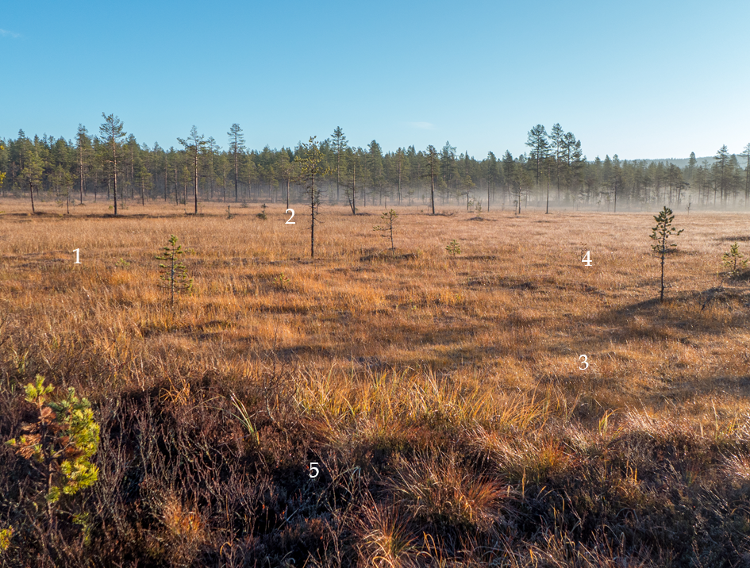
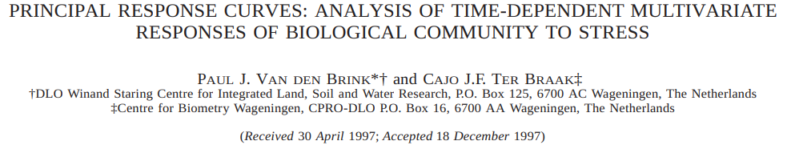

layout:true
<div class="my-footer"><div class="my-footer-nested-left">`r icons::icon_style(icons::fontawesome("twitter"),fill="white")`@vdVeenB</div>
<div class="my-footer-nested-right">`r icons::icon_style(icons::fontawesome("envelope"),fill="white")`bert.v.d.veen@ntnu.no </div></div>

---

```{r setup, include=FALSE, echo=F}
#could use xaringanthemer package to set the theme up further here
knitr::opts_chunk$set(echo = FALSE, message=F, warning=F, fig.retina=3)
knitr::opts_knit$set(root.dir="/home/bertv/Dropbox/Uppsala/workshop/")

```

class:clear,middle


add ntnu logo

## What is this presentation about?

- Brief introduction
- Overview of different software packages for model-based ordination
- In-depth information about the gllvm R-package
- Some examples

---

# Gathering data

We go out, register species at multiple sites <br>


```{r out.width="550px",fig.cap="© Geir-Harald Strand / NIBIO", fig.align="center"} 
knitr::include_graphics("heath_picture.png")
```

---

# Gathering data

We go out, register species at multiple sites <br>

```{r out.width="550px",fig.cap="© Geir-Harald Strand / NIBIO", fig.align="center"} 

```

---

# "Multivariate"


- What does multivariate mean? <!--TIP: not multiple predictors, but multiple responses -->

- Multivariate: multiple <b>responses</b>
- E.g. counts of species at sites

.font70[
```{r}
library(mvabund)
library(kableExtra)
data(spider)
dat<-head(spider$abund)
colnames(dat) <- paste("Species", 1:12)
row.names(dat) <- paste("Site", 1:6)

dat <- dat[1:3,1:5]
dat %>%kable()%>%kable_styling(full_width = T)%>%
  kableExtra::row_spec( 0, extra_css = "border-bottom: 1px solid; width:100%",)%>%
  column_spec(1,border_right=T)
```
]

---

# "Multivariable"

- Multiple <b> predictors </b>
- E.g. measurements of the environment

.font70[
```{r}
dat<-spider$x[1:3,1:5]
colnames(dat) <- paste("Predictor", 1:5)
row.names(dat) <- paste("Site", 1:3)

dat %>%kable()%>%kable_styling(full_width = T)%>%
  kableExtra::row_spec( 0, extra_css = "border-bottom: 1px solid; width:100%",)%>%
  column_spec(1,border_right=T)
```
]

---

# To clarify

- Both data and model can be univariate or multivariate
- Multivariate data can be analysed with both multivariate and univariate models (SDM, CA)

- Multivariable data can be used in multivariate or univariate analysis
  - Generally the same for all responses
  - (But, note that the model can of course set terms to zero)

---

# Why analyse multivariate data?

- Interest in <b>co</b>-occurrence patterns
  - In contrast to <b> occurrence </b> patterns (a species distribution)
- Why do species co-occur?
  - Similar environmental preferences
  - Similar history in the environment
  - Might results in **Interactions**
- Multiple species form a <b> community </b>

---

# Why analyse multivariate data?

.pull-left[
.center[.font100[ Occurrence pattern]]
```{r, fig.align="center", fig.width=4, fig.height=4}
#https://stats.stackexchange.com/questions/12209/percentage-of-overlapping-regions-of-two-normal-distributions
min.f1f2 <- function(x, mu1, mu2, sd1, sd2) {
    f1 <- dnorm(x, mean=mu1, sd=sd1)
    f2 <- dnorm(x, mean=mu2, sd=sd2)
    pmin(f1, f2)
}

mu1 <- -2;    sd1 <- 2
mu2 <- 1;    sd2 <- 1

xs <- seq(min(mu1 - 3*sd1, mu2 - 3*sd2), max(mu1 + 3*sd1, mu2 + 3*sd2), .001)#could use curve instead easily and would look smoother
f1 <- dnorm(xs, mean=mu1, sd=sd1)
par(mar=c(5, 5, 2, 2) + 0.1)
plot(xs, f1, type="l", ylim=c(0.001, max(f1)+0.001), col="green",yaxs="i",yaxt="n",xaxt="n",xlab="Environment", ylab="Abundance/occurrence", cex.lab=1.8,cex.axis=1.8)

segments(x0=mu1,y0=0,y1=0.2,lty="dashed",col="green")

arrows(y0=0.12,x0=mu1,x1=mu1-sd1,code = 3,col="green",length=0.2)


```

]


.pull-right[
.font100[Co-occurrence pattern]
```{r, fig.align="center", fig.width=4, fig.height=4}
#https://stats.stackexchange.com/questions/12209/percentage-of-overlapping-regions-of-two-normal-distributions
min.f1f2 <- function(x, mu1, mu2, sd1, sd2) {
    f1 <- dnorm(x, mean=mu1, sd=sd1)
    f2 <- dnorm(x, mean=mu2, sd=sd2)
    pmin(f1, f2)
}

mu1 <- -2;    sd1 <- 2
mu2 <- 1;    sd2 <- 1

xs <- seq(min(mu1 - 3*sd1, mu2 - 3*sd2), max(mu1 + 3*sd1, mu2 + 3*sd2), .001)#could use curve instead easily and would look smoother
f1 <- dnorm(xs, mean=mu1, sd=sd1)
f2 <- dnorm(xs, mean=mu2, sd=sd2)
par(mar=c(5, 5, 2, 2) + 0.1)
plot(xs, f1, type="l", ylim=c(0.001, max(f1,f2)), col="green",yaxs="i",yaxt="n",xaxt="n",xlab="Environment", ylab="Abundance/occurrence", cex.lab=1.8,cex.axis=1.8)

lines(xs[f2>0.001], f2[f2>0.001], col="blue")
segments(x0=mu1,y0=0,y1=0.2,lty="dashed",col="green")
segments(x0=mu2,y0=0,y1=0.4,lty="dashed",col="blue")
#1sd is just under 2/3 of height
arrows(y0=0.12,x0=mu1,x1=mu1-sd1,code = 3,col="green",length=0.2)
arrows(y0=0.24,x0=mu2,x1=mu2+sd2,code = 3,col="blue",length=0.2)

text(x=mu1-2,y=0.2,labels = "Generalist")
text(x=mu2+2,y=0.3,labels = "Specialist")

ys <- min.f1f2(xs, mu1=mu1, mu2=mu2, sd1=sd1, sd2=sd2)
xs <- c(xs, xs[1])
ys <- c(ys, ys[1])
polygon(xs, ys, col="black",density=5,border=NA)

```

]

---

# But then for more species
.center[


<br>**from: Bascompte (2019)**

]

---


# Co-occurrence

.pull-left[
- Occurrence data can tell use about where multiple species occur
- How species are "associated"
- Statistically: correlation
- So we are looking for patterns in our data

]
.pull-right[
```{r, fig.width=5,fig.height=5,fig.align="center"}
library(gllvm)
mod<-gllvm(spider$abund,num.lv=2,row.eff="random",family="negative.binomial",sd.errors=F)
library(corrplot)
corrplot(gllvm::getResidualCor(mod), order = "AOE", type= "lower")
```
]

---

class: clear,middle,center

## Ecological gradient analysis

.pull-top[
"Gradient analysis is a research approach for study of spatial patterns of species." .font70[**(Whittaker, 1967)**]<br>
Our sites describe the environment. Multiple gradients can form a <b>complex</b> gradient. <br>
]
.pull-bottom[
.font70[
```{r}
library(kableExtra)
dat<-spider$x[1:3,1:5]
colnames(dat) <- paste("Predictor", 1:5)
row.names(dat) <- paste("Site", 1:3)

dat %>% 
  kable(booktabs = T) %>%
  kable_styling() %>%
 column_spec(1:3, bold = TRUE, border_right = "2px solid red")

```
]
]

---

class: clear

.center[## Ecological gradients]

1) Ecological gradient: gradual change in the environment 

- e.g. temperature

2) Complex gradient: change in several ecological gradients 

- e.g. soil moisture and acidity on an elevation gradient
- Can be represented as a single factor, covariate, predictor, latent variable, ordination axis


---

class:clear,middle,center

Gradients can be <b>observed</b> or <b>latent</b>


```{r, fig.align="center",out.width="75%"}
knitr::include_graphics("latent.jpg")
```


---

# Ecological gradients

<br>

.center[
.font170["Few major complex ecological gradients normally account for most of the variation in species composition."] .font70[**(Halvorsen, 2012)**]
]


.center[
## In essence:
Community structure is generally low-dimensional.

]

???

There is also coenoclines

---

# Ordination: visual inspection

- Most common tool is the biplot .font70[Gabriel 1971]
- Distance between species indicates dissimilarity
- Distance between sites indicates dissimilarity

```{r, fig.align="center", fig.width=5, fig.height = 5}
mu1 <- -2;    sd1 <- 2
mu2 <- 0.5;    sd2 <- 1
mu11 <- 2;  sd11 <- 1
mu21 <- 1.5; sd21 <- 0.5
parold<-par()
par(mar=c(5, 5, 0.5, 2) + 0.1)
plot(c(mu1,mu2),c(mu11,mu21),xlab="Dimension 1", ylab="Dimension 2",xaxt="n",yaxt="n",xlim=c(-4,2),ylim=c(0.5,3), cex.lab=1.8,type = "n")
abline(v=-1,h=1.75,col="gray",lty="dashed")
points(x=mu1,y=mu11,pch=20,col="blue",cex=2)
text(x=mu1,y=mu11,labels = "Species 1",col="blue",pos = 3)
points(x=mu2,y=mu21,pch=20,col="green",cex=2)
text(x=mu2,y=mu21,labels = "Species 2",col="green",pos = 1)
box()
text(-2,1.5,labels=1,col="black")
text(0,2,labels=2,col="black")
text(0,1,labels=3,col="black")
text(1.2,3,labels=4,col="black")
text(-1,1,labels=5,col="black")
library(shape)
par(parold)
```

---

# Triplot

- commonly used in constrained ordination
- three quantities so "tri"
- arrows indicate environment-axis relationship

```{r, fig.align="center", fig.width=5, fig.height = 5}
mu1 <- -2;    sd1 <- 2
mu2 <- 0.5;    sd2 <- 1
mu11 <- 2;  sd11 <- 1
mu21 <- 1.5; sd21 <- 0.5
parold<-par()
par(mar=c(5, 5, 0.5, 2) + 0.1)
plot(c(mu1,mu2),c(mu11,mu21),xlab="Dimension 1", ylab="Dimension 2",xaxt="n",yaxt="n",xlim=c(-4,2),ylim=c(0.5,3), cex.lab=1.8,type = "n")
abline(v=-1,h=1.75,col="gray",lty="dashed")
points(x=mu1,y=mu11,pch=20,col="blue",cex=2)
text(x=mu1,y=mu11,labels = "Species 1",col="blue",pos = 3)
points(x=mu2,y=mu21,pch=20,col="green",cex=2)
text(x=mu2,y=mu21,labels = "Species 2",col="green",pos = 1)
box()
text(-2,1.5,labels=1,col="black")
text(0,2,labels=2,col="black")
text(0,1,labels=3,col="black")
text(1.2,3,labels=4,col="black")
text(-1,1,labels=5,col="black")
library(shape)
marg<-par("usr")
Xlength<-sum(abs(marg[1:2]))/2
Ylength<-sum(abs(marg[3:4]))/2
origin<- c(mean(marg[1:2]),mean(marg[3:4]))
arrows(-1,1.74,1,1, col = "red")
```


---

class:clear,middle

## Classical methods have some issues..

- Ordination axis (ecological gradient) treated as fixed (parameter)
- Horseshoe or arch effect (PCA, CA)
- Difficult (near to impossible) to check any assumptions
- Mean-variance relationships .font70[Warton and Hui 2017]

<br>

.center[.font120[<b>In general, not very flexible.</b>]]

---

# Model-based thinking

- Concept: apply regression concepts to multivariate analysis .font70[Warton et al. 2015]
  - Explicit statistical models
  - Residual diagnostics
  - Model selection
  - et cetera
  
.center[]
  
---

# A regression

- Think of these as GLMs per column
- Or a stacked S(A)DM 

\begin{equation}
\eta_{ij} = \beta_{0j} + \boldsymbol{X}\boldsymbol{B}
\end{equation}

- $\boldsymbol{X}$ are the predictors
- $\boldsymbol{B}$ are the slopes for all column

---


# .font70[Generalized Linear Latent Variable Models]

- GLLVM for short (Skrondal & Rabe-Hesketh, 2004)
- a "joint" model

\begin{equation}
\eta_{ij} = \beta_{0j} + \boldsymbol{Z}\boldsymbol{\Gamma}
\end{equation}

- But the predictor(s) are now missing
- So we predict them instead: that is what $\boldsymbol{Z}$ is
  - so $\boldsymbol{\Gamma}$ are the coefficients
- Also known as "ordination axis" or "latent variable" or...

???

- more advanced factor analysis
- more formal ordination method 
- unified framework for ordination but also other things
- mixed-effects models, clustering, anything with latents

---

.left[
# Benefits from both worlds
]

.pull-left[
- Represent the latent complex ecological gradient
- A model like in regression
]

.pull-right[
 
- Procrustus analysis
- Biplots
- Model-selection
- Residual diagnostics
- Appropriate mean-variance relationships
- No distances
- Hypothesis testing
- etc.
 
 ]

 .center[<b>All the benefits from regression and ordination!</b><br>
 (and double the complexity)]


---

# Comparing and selecting ordinations

- you fit a model
- you fit another model
- which one is better?
  - information criteria
  - hypothesis testing
- but are the ordinations similar?
  - procrustes rotation
- variation explained (no eigenvalues)

???

- information criteria; allow to compare non-nested models (APPLY IN MODERATION)
- hypothesis testing: nested models
- procrustes rotation: for ordinations only, whatever
  - can apply certain functions from vegan and other like GPArotation


---

# Some brief notes on rotation
 
- LVs are estimated simultaneously
 - Rotation is not varimax
 - Solution can be re-rotated afterwards (see e.g., the GPArotation package)
  - To certain species, to predictors, or by some criterium

```{r, fig.align="center", out.width = "80%", echo=F}

```

---
  
# Different packages

I will briefly go through the different model-based ordination packages
NB: Quickly expanding field

???
- few do constrained ordination
- all unconstrained (partly due to JSDM push)
- pseudo-code for unconstrained ordination in each package

---

# Boral

```{r, fig.align="center", out.width = "80%", echo=F}
knitr::include_graphics("Boral.png")
```

- one of the first model-based ordination packages
- mostly for unconstrained (or residal) ordination
- can include column effects (traits)
- row-effects; row intercepts, structure for LVs, predictors
- includes gold-standard residuals

???

- By Francis
- Runs on Jags
- distance matrix for spatial (usual)

---

class: clear, middle

## Boral: code

```{r boral, eval = F, echo=T}
install.packages("boral")
model <- boral::boral(y, lv.control=list(num.lv = 2), family = ...)
lvsplot(model)
```

vignette: see paper

???

- more complex models

---

# HMSC

```{r, fig.align="center", echo=F, out.width = "80%"}
knitr::include_graphics("HMSC.png")
```

- Bayesian; fits with MCMC
- many options
- specifically for community modeling
- phylogeny, traits, row-effects, spatial
- mostly JSDMs, little support for ordination
- "infinite factor model"

???

- TBH little experience
- VERY flexible
- super popular, many people use
- not sure what else to say
- not intended for ordination, but can be used as such

---

class:clear, middle

## HMSC: code

.font70[

```{r HMSC, eval=F, echo=T}
install.packages("Hmsc")
# need to set-up LVs
studyDesign = data.frame(sample = as.factor(1:nrow(y)))
rL = HmscRandomLevel(units = studyDesign$sample)
model <- Hmsc::Hmsc(y, X = as.matrix(spider$x), distr = "poisson", ranLevels = list(sample = rL), studyDesign = studyDesign)
# Run mcmc
run = sampleMcmc(model, thin = ..., samples = ..., transient = ...,
nChains = ...)
# make biplot
etaPost=getPostEstimate(run, "Eta")
lambdaPost=getPostEstimate(run, "Lambda")
biPlot(run, etaPost = etaPost, lambdaPost = lambdaPost, factors = c(1,2))
```

]

vignette: https://cran.r-project.org/web/packages/Hmsc/vignettes/vignette_2_multivariate_low.pdf

---
  
# ecoCopula
```{r, fig.align="center", echo=F, out.width = "80%"}

```

- extremely fast (faster than NMDS); fits with gaussian copulas
- graphical modeling; 
- can visualize "direct associations"
- gold-standard residuals
- requires a secondary model


???

Parallelization

---

class:clear,middle

## ecoCopula: code

```{r, eval=F, echo=T}
install.packages(c("ecoCopula","mvabund"))
pre_model <- mvabund::manyglm(y, family = ...)
model <- ecoCopula::cord(pre_model, nlv = 2)
plot(model,biplot = TRUE)
```

vignette: https://cran.r-project.org/web/packages/ecoCopula/vignettes/the_basics.html

---

# VGAM
```{r, fig.align="center", echo=F, out.width = "80%"}
knitr::include_graphics("VGAM.png")
```

.font70[
.pull-left[
- fits with maximum likelihood
- massive package with a lot of functionality
- constrained and unconstrained ordination
- UQO, CQO, CAO
]
.pull-right[
- residuals
- not great to use (can be unstable)
- mostly for ordination
- no random-effects
]

]
---

class:clear,middle

## VGAM: code

```{r, eval=F, echo=T}
install.packages("VGAM")
model <- VGAM::rcim(y, Rank = 2, family = ...)
lvplot(model)
```

vignette: (see book)

---

# glmmTMB
```{r, fig.align="center", echo=F, out.width = "80%"}
knitr::include_graphics("glmmTMB.png")
```

- fits with Laplace approximation
- great usability
- can include many random-effects
- unconstrained ordination only
- relatively slow

???

can be a bit messy

---

class:clear,middle

## glmmTMB: code

- data needs to be in long format

```{r, eval=F, echo=T}
install.packages("glmmTMB")
# organize data into long format
sppTot <- sort(colSums(y), decreasing = TRUE)
tmp <- data.frame(y)
tmp$id <- 1:nrow(tmp)
glmmDat <- reshape(tmp,
                     idvar = "id",
                     timevar = "col",
                     times =  colnames(y),
                     varying = list(colnames(y)),
                     v.names = "y",
                     direction = "long")
model <- glmmTMB::glmmTMB(y ~ col + rr(col + 0|id, d = 2), data = glmmDat, family = ...)
```

vignette: https://cran.r-project.org/web/packages/glmmTMB/vignettes/covstruct.html

---

# gmf

.pull-left[
```{r, fig.align="center", echo=F, out.width = "99%"}
knitr::include_graphics("gmf.png")
```
]
.pull-right[

- very quick; fits by penalized likelihood
- unconstrained ordination only
- no extra random-effects
- can be unstable

]

---

class:clear,middle

## gmf: code

```{r, eval = F, echo=T}
devtools::install_github("https://github.com/kidzik/gmf")
model <- gmf::gmf(y, family = ..., p = 2)
```

---

# RCM
```{r, fig.align="center", echo=F, out.width = "80%"}

```

- constrained and unconstrained ordination
- additive constrained ordination
- few distributions
- not a "true" statistical model

???

- no CI or hypothesis testing
developed with eye on microbial community ecology

---

class:clear,middle

## RCM: code

```{r, eval = F, echo=T}
devtools::install_github("https://github.com/CenterForStatistics-UGent/RCM")
model <- RCM::RCM(y, k = 2)
plot(model)
```

vignette: https://github.com/CenterForStatistics-UGent/RCM

---

class:clear,middle

## Experimental: latent INLA

```{r, fig.align="center", echo=F, out.width = "70%"}
knitr::include_graphics("latentINLA.png")
```

- Relatively fast; Bayesian with Laplace approximation
- unconstrained and concurrent ordination
- spatial effects? work in progress

---

class:clear,middle

## latent INLA: code

```{r, eval = F, echo=T}
devtools::install_github("https://github.com/oharar/LatentINLA")
model <- FitGLLVM(Y=Y, Family="poisson", nLVs = 2)
```

vignette: https://github.com/oharar/LatentINLA/blob/main/vignettes/How-A-Simple-Model-Works.Rmd

---

# gllvm

```{r, fig.align="center", echo=F, out.width = "80%"}

```


- relatively fast
- many different models for concurrent, constrained, unconstrained ordination
- can include extra random-effects
- quite robust
- CI, hypothesis testing
- gold-standard residuals

---

class:clear,middle

## gllvm: code

```{r, eval = F, echo = T}
install.packages("gllvm")
model  <- gllvm::gllvm(y, num.lv = 2, family = ...)
```

vignette: https://jenniniku.github.io/gllvm/index.html

---

# Software summary

.font70[
```{r softwares}

tab <- data.frame(
  package = c("gllvm", "Boral", "HMSC", "ecoCopula", "VGAM", "glmmTMB", "gmf", "RCM","latent INLA"),
  cran = c("yes","yes","yes","yes","yes","yes","no","no","no"),
  UO = c("yes","yes","yes","yes","yes","yes","yes","yes","yes"),
  CO = c("yes","no","no","no","yes","no","no","yes","not yet"),
  CN = c("yes","no","no","no","no","no","no","no","yes"),
  RE = c("yes/some","some","yes","no","no","yes","no","no","yes"),
  CI = c("yes","yes","yes","no","half","yes","no","no","yes"),
  traits = c("yes","yes","yes","no","no","no","no","no","no"),
  framework = c("frequentist","bayes","bayes","frequentist","frequentist","frequentist","frequentist","frequentist","bayes")
)

library(knitr)
library(tidyr)
library(kableExtra)
tab %>%kable(caption = "R-packages for model-based ordination")%>%kable_styling(full_width = T)%>%
  kableExtra::row_spec( 0, extra_css = "border-bottom: 1px solid; width:100%",)%>%
  column_spec(1,border_right=T)
```

]

???
- ignore NIMBLE, TMB and other frameworks.
- explain some differences: RCM not "proper" model-based
- additve constrained ordination
- I  will take you through some of themm
- gllvm can do all sorts of ordinations, and with random-effects (only package), so flexible

---

# The gllvm R-package

```{r, fig.align="center", echo=F, out.width = "80%"}

```

.pull-left[
- first published in 2017
- (relatively) fast model fitting
- but loads of developments since then
- now a solid package for ordination
]
.pull-right[

- account for properties of data
- residual diagnostics
- model-selection tools
- typical conditions of statistical modeling
- flexible framework: straightforward to extend

]

note gllvm website: https://jenniniku.github.io/gllvm/index.html

???

- typical conditions: large sample theory


---

class:clear,center,middle

```{r, echo=F, out.width = "30%", fig.show="hold"}

knitr::include_graphics("hui.jpg")
knitr::include_graphics("pekka.jpg")

knitr::include_graphics("warton.jpg")
knitr::include_graphics("bob.jpg")
```

Jenni Niku (JYU), Francis Hui (ANU), Pekka Korhonen (JYU), Sara Taskinen (JYU), David Warton (UNSW), Bob O'Hara (NTNU)

???

many people are involved, here are some

---

# Brief brief history of gllvm

```{r, fig.align="center", echo=F, out.width = "80%"}

```

--

```{r, echo=F, fig.show="hold", out.width="33%"}


```

- a search for fast (and flexible) fitting methods
- because life is too short for MCMC

???

- all started with Hui 2015
- then the push for bringing things to ecology started

---

# Likelihood

The likelihood for a GLLVM is:
\begin{equation}
\mathcal{L}(\Theta;\boldsymbol{Y}) = \prod \limits_{i=1}^n \displaystyle\int \prod \limits_{j=1}^p \color{red}{f\biggl(y_{ij} \vert \boldsymbol{z}_i, \Theta\biggr)}\color{blue}{h\biggl(\boldsymbol{z}_i\biggr)} d\boldsymbol{z}_i ,
\label{gllvm}
\end{equation}

- similar to glmm but "worse"
- fitted by (E)VA or LA
- why is this important to know?

???

- behaviors of different esitmaiton methods
- because there are details to controlling the estimation that we can get back to later.

---

class: clear,middle

## Distribution and link function


\begin{equation}
\color{red}{f\biggl(y_{ij} \vert \boldsymbol{z}_i, \Theta\biggr)} = \text{exp}[\{\color{red}{y_{ij}}\color{green}{\eta_{ij}} - \color{brown}{g^{-1}}(\color{green}{\eta_{ij}})\}/\phi_j + c(\color{red}{y_{ij}},\phi_j)]
\end{equation}

- "the GLM bit"
- $\eta_{ij}$ is the linear predictor
- and $\mu_{ij} = g^{-1}(\eta_{ij})$
- non-linearity and mean-variance

---

# Distributions and links  

.font70[

| Response          | Distribution | Method  | Link  |
| ----------------|:------------:|:------- |:------- |
|Counts  	        | Poisson 	   | VA/LA   |log	    |
|                 | NB    	     | VA/LA   |log		  |
|                 | ZIP       	 | LA      |log		  |
|Binary           | Bernoulli 	 | VA/LA   |probit/logit  |
|Various    	    | Tweedie 	   | LA/EVA  |log 	  |  
|Ordinal 	        | Multinomial  | VA      | cumulative probit  | 
|Normal           | Gaussian     | VA/LA   |identity| 
|Positive continuous| Gamma     | VA/LA   |log|
|Non-negative continuous| Exponential | VA/LA   |log| 
|0-1    | beta    	   | LA/EVA | probit/logit |

]

---

# Algorithm

```{r, fig.align="center", echo=F, out.width = "80%"}

```

- non-convexity makes it hard to find optimal fit
- kind of like NMDS
- strategies for multiple restarts are important

---

class: clear,middle

## When I came in 

```{r, fig.align="center", echo=F, out.width = "80%"}

```

- making model-based ordination useful for ecologists
- quadratic responses? maybe not so much

???

- continue the hype from the 80s
- random row-effect is perhaps more useful

---

# More conceptual advances

.pull-top[

```{r, fig.align="center", echo=F, out.width = "90%"}
knitr::include_graphics("NikuTraits.png")
```


]

.pull-bottom[

```{r, fig.align="center", echo=F, out.width = "99%"}
knitr::include_graphics("van_der_Veen_et_al_2022.png")
```


]

- spatial is still in development, and more developments to come in the future

???

- might want to stay away from spatial.

---

# Different models in gllvm

- species intercept is ALWAYS included
- row intercept is optional ("composition")
- can include an offset (a-priori row-intercept)
- if we have observed all predictors
  - in or outside of ordination
- if we have observed some predictors
- if we have two sets of predictors (e.g., traits and environment)
- if we want to add random row-effects for pseudoreplication
- if we want to do ordination

---

# How to use gllvm

```{r, echo=T, eval=F}
gllvm(y = NULL, X = NULL, TR = NULL, family, num.lv = NULL, num.lv.c = 0, num.RR = 0, 
formula = NULL, lv.formula = NULL, method = "VA", row.eff = FALSE, studyDesign = NULL, n.init=1, sd.errors = TRUE, quadratic = FALSE, randomB = FALSE, randomX = FALSE, ...)
```

.font70[
.pull-left[
- y: matrix of abundances
- X: matrix or data.frame of (environmental) variables
- TR: matrix or data.frame of trait variables
- family: distribution for responses
- num.lv/num.lv.c/num.RR: number of unconstrained/concurrent/constrained latent variables
- a lot of control options
]
.pull-right[
- formula/lv.formula: formula for predictors
- method: approximation used "VA", "EVA", or “LA”
- row.eff, studyDesign: row effects
- n.init: number of random starting points for latent variables
- sd.errors: should they be calculated?
- quadratic: for quadratic responses to LVs
- randomB: random canonical coefficients (with num.lv.c or num.RR)
- randomX: random-effects for 4th corner
]
]
???

The Main function of the gllvm package is gllvm(), which can be used to fit
GLLVMs for multivariate data with the most important arguments listed in
the following:

---

# Function reference

```{r, fig.align="center", echo=F, out.width = "60%"}

```

https://jenniniku.github.io/gllvm/reference/index.html

---

# Page of common errors
- ordiplot vegan overlaps
- sd.errors cannot be calculated
- convergence stuff: maximum iterations, starting values

<b>We try to make it intuitive, but if it isn't post on github for help.</b>

---

# Some examples

- morphometrics
- community data
- microbial community

---

# Example: Wood mouse mandibles

- Morphometric example: predicting size and shape
- 30 individuals from 3 species (10 each) of wood mice
- 64 landmarks at border


```{r, fig.align="center", echo=F, out.width = "60%"}

```

article: https://onlinelibrary.wiley.com/doi/full/10.1046/j.1365-2699.2003.00932.x⁠

---

# 1) Start by plotting the data

.center[
```{r, echo=F, eval=T, fig.height=5,fig.width=5}
library(gllvm)
library(Momocs)
# mouse mandibles
dat <- array(unlist(apodemus[[1]]),dim=c(nrow(apodemus[[1]][[1]]),2,length(apodemus[[1]])))
dat<-sapply(seq(dim(dat)[3]), function(x) matrix(unlist(apply(dat[,,x],1,c,simplify = F)),ncol=1))
# plot data
plot(NA,type="n",xlim=c(5,25), ylim=c(0,40),ylab="y",xlab="x", main="Data points") 
cols<-scales::alpha(c("blue","black","brown"),0.5)
for(i in 1:ncol(dat)){
  points(apodemus[[1]][[i]][,1],apodemus[[1]][[i]][,2],  col = cols[as.numeric(unlist(apodemus[[2]][,3]))][i])
}
abline(h=c(10,30), lty="dashed",col="red")

plot(NA,type="n",xlim=c(5,25), ylim=c(0,40),ylab="y",xlab="x", main="Data lines") 
cols<-scales::alpha(c("blue","black","brown"),0.5)
for(i in 1:ncol(dat)){
  lines(apodemus[[1]][[i]][,1],apodemus[[1]][[i]][,2],  col = cols[as.numeric(unlist(apodemus[[2]][,3]))][i])
}
abline(h=c(10,30), lty="dashed",col="red")
```
]

What is the dimensionality of shape?

???

- Red line for readability
- These coordinates look positive-only..


---

# Step 2: format data

- "Apodemus" is a tibble with a list of coordinates
- Need to reformat into a 2d matrix
  - Coordinates on the rows
  - Individuals on the columns

```{r, echo=T, eval=T}
library(Momocs)
data(apodemus)
# "Apodemus" is a tibble that holds a list
# to 3d array first
dat <- array(unlist(apodemus[[1]]),dim=c(nrow(apodemus[[1]][[1]]),2,length(apodemus[[1]])))
# then to matrix
dat<-sapply(seq(dim(dat)[3]), function(x) matrix(unlist(apply(dat[,,x],1,c,simplify = F)),ncol=1))
```

---

# Step 3: Fitting the GLLVM(s)

```{r, echo=T, eval=F}
library(gllvm)
model <- gllvm(y = dat, family = "gamma", num.lv = 1, 
starting.val = "random", n.init = 3)
model
```
.font80[
```{r, echo=F, eval=T}
load("mice.mods.RData")
mod.one <-mods[[1]]
mod.one
mod.two<-mods[[2]]
mod.three<-mods[[3]]
mod.four<-mods[[4]]
mod.five <- mods[[5]]
```
]

???

- explain what we see in this print of the model

---

# Step 4: Model-selection

- I fitted models with 1-5 LVs
- More complex shapes will need more LVs

```{r mouse1, echo=T, eval=T, fig.align="center"}
AIC(mod.one, mod.two, mod.three, mod.four, mod.five)
```

- We need to find a model that is appropriate, but not too complex
- Can also use `AICc` or `BIC` instead

???  

- Please use information criteria in moderation
Conclusion: 4 LVs is "best" <br>
Next: confirm our model choice
"best" is determined by the choice of information criterium

---

# Step 5: Residual diagnostics

```{r mouseresid, echo=T, eval=T, fig.align="center", fig.width=10, fig.height=6}
par(mfrow=c(2,2))
plot(mod.four,which=1:4)
```

---

# Step 5: Residual diagnostics (2)

```{r mouseresid2, echo=T, eval=F, fig.align="center", fig.width=10}
model <- gllvm(y = dat, num.lv = 4, family = "tweedie", 
starting.val = "random", n.init = 5)
```
```{r tweed, echo=F, eval=T, fig.align="center", fig.width=10, fig.height=6}
load("mice.tweedie.RData")
plot(model,which=2)
#mod.four<-update(mod.four,family="tweedie")
```

---

# Step 6: Predicting mandible shape

```{r mousepred, echo=F, eval=T, fig.align="center", fig.width=10}
# mod.one<-gllvm(dat,num.lv=1,family="gamma",n.init=5,row.eff=F,starting.val="random")
# mod.two<-update(mod.one,num.lv=2)
# mod.three <- update(mod.one,num.lv=3)
# mod.four <- update(mod.three,num.lv=4)
# mod.five <- update(mod.four,num.lv=5)
# mods<-list(mod.one,mod.two,mod.three,mod.four,mod.five)
# save(mods,file="mice.mods.RData")

#to get range for plot
eta<-predict(mods[[4]],type="response")
coordPred<-array(unlist(sapply(seq(ncol(dat)), function(x) matrix((eta)[,x],ncol=2,byrow=T),simplify = F)),dim=c(nrow(dat)/2,2,ncol(dat)))

par(mfrow=c(2,3))

# plot data
plot(NA,type="n",xlim=c(range(coordPred[,1,])),ylim=range(coordPred[,2,]), ylab="y",xlab="x", main="Data") 
cols<-scales::alpha(c("blue","black","brown"),0.5)
for(i in 1:ncol(dat)){
  lines(apodemus[[1]][[i]][,1],apodemus[[1]][[i]][,2],  col = cols[as.numeric(unlist(apodemus[[2]][,3]))][i])
}
abline(h=c(10,30), lty="dashed",col="red")

#one LV
eta<-predict(mods[[1]],type="response")
coordPred<-array(unlist(sapply(seq(ncol(dat)), function(x) matrix((eta)[,x],ncol=2,byrow=T),simplify = F)),dim=c(nrow(dat)/2,2,ncol(dat)))

plot(NA,type="n",xlim=c(range(coordPred[,1,])),ylim=range(coordPred[,2,]), ylab="y",xlab="x", main="1 LV") 
cols<-scales::alpha(c("blue","black","brown"),0.5)
for(i in 1:ncol(dat)){
  lines(coordPred[,1,i],coordPred[,2,i],  col = cols[as.numeric(unlist(apodemus[[2]][,3]))][i])
}
abline(h=c(10,30), lty="dashed",col="red")
#two LVs
eta<-predict(mods[[2]],type="response")
coordPred<-array(unlist(sapply(seq(ncol(dat)), function(x) matrix((eta)[,x],ncol=2,byrow=T),simplify = F)),dim=c(nrow(dat)/2,2,ncol(dat)))

plot(NA,type="n",xlim=c(range(coordPred[,1,])),ylim=range(coordPred[,2,]), ylab="y",xlab="x", main="2 LVs") 
cols<-scales::alpha(c("blue","black","brown"),0.5)
for(i in 1:ncol(dat)){
  lines(coordPred[,1,i],coordPred[,2,i],  col = cols[as.numeric(unlist(apodemus[[2]][,3]))][i])
}
abline(h=c(10,30), lty="dashed",col="red")
#three LVs
eta<-predict(mods[[3]],type="response")
coordPred<-array(unlist(sapply(seq(ncol(dat)), function(x) matrix((eta)[,x],ncol=2,byrow=T),simplify = F)),dim=c(nrow(dat)/2,2,ncol(dat)))

plot(NA,type="n",xlim=c(range(coordPred[,1,])),ylim=range(coordPred[,2,]), ylab="y",xlab="x", main="3 LVs") 
cols<-scales::alpha(c("blue","black","brown"),0.5)
for(i in 1:ncol(dat)){
  lines(coordPred[,1,i],coordPred[,2,i],  col = cols[as.numeric(unlist(apodemus[[2]][,3]))][i])
}
abline(h=c(10,30), lty="dashed",col="red")
#four LVs
eta<-predict(mods[[4]],type="response")
coordPred<-array(unlist(sapply(seq(ncol(dat)), function(x) matrix((eta)[,x],ncol=2,byrow=T),simplify = F)),dim=c(nrow(dat)/2,2,ncol(dat)))

plot(NA,type="n",xlim=c(range(coordPred[,1,])),ylim=range(coordPred[,2,]), ylab="y",xlab="x", main="4 LVs") 
cols<-scales::alpha(c("blue","black","brown"),0.5)
for(i in 1:ncol(dat)){
  lines(coordPred[,1,i],coordPred[,2,i],  col = cols[as.numeric(unlist(apodemus[[2]][,3]))][i])
}
abline(h=c(10,30), lty="dashed",col="red")
#five LVs
eta<-predict(mods[[5]],type="response")
coordPred<-array(unlist(sapply(seq(ncol(dat)), function(x) matrix((eta)[,x],ncol=2,byrow=T),simplify = F)),dim=c(nrow(dat)/2,2,ncol(dat)))

plot(NA,type="n",xlim=c(range(coordPred[,1,])),ylim=range(coordPred[,2,]), ylab="y",xlab="x",main="5 LVs") 
cols<-scales::alpha(c("blue","black","brown"),0.5)
for(i in 1:ncol(dat)){
  lines(coordPred[,1,i],coordPred[,2,i],  col = cols[as.numeric(unlist(apodemus[[2]][,3]))][i])
}
abline(h=c(10,30), lty="dashed",col="red")
```

---

# A bit larger

```{r mousepred2, echo=F, eval=T, fig.align="center",fig.width=10}
# mod.one<-gllvm(dat,num.lv=1,family="gamma",n.init=5,row.eff=F,starting.val="random")
# mod.two<-update(mod.one,num.lv=2)
# mod.three <- update(mod.one,num.lv=3)
# mod.four <- update(mod.three,num.lv=4)
# mod.five <- update(mod.four,num.lv=5)
# mods<-list(mod.one,mod.two,mod.three,mod.four,mod.five)
# save(mods,file="mice.mods.RData")

#to get range for plot
eta<-predict(mods[[4]],type="response")
coordPred<-array(unlist(sapply(seq(ncol(dat)), function(x) matrix((eta)[,x],ncol=2,byrow=T),simplify = F)),dim=c(nrow(dat)/2,2,ncol(dat)))

par(mfrow=c(1,3))

# plot data
plot(NA,type="n",xlim=c(range(coordPred[,1,])),ylim=range(coordPred[,2,]), ylab="y",xlab="x", main="Data") 
cols<-scales::alpha(c("blue","black","brown"),0.5)
for(i in 1:ncol(dat)){
  lines(apodemus[[1]][[i]][,1],apodemus[[1]][[i]][,2],  col = cols[as.numeric(unlist(apodemus[[2]][,3]))][i])
}
abline(h=c(10,30), lty="dashed",col="red")

#four LVs
eta<-predict(mods[[4]],type="response")
coordPred<-array(unlist(sapply(seq(ncol(dat)), function(x) matrix((eta)[,x],ncol=2,byrow=T),simplify = F)),dim=c(nrow(dat)/2,2,ncol(dat)))

plot(NA,type="n",xlim=c(range(coordPred[,1,])),ylim=range(coordPred[,2,]), ylab="y",xlab="x", main="4 LVs") 
cols<-scales::alpha(c("blue","black","brown"),0.5)
for(i in 1:ncol(dat)){
  lines(coordPred[,1,i],coordPred[,2,i],  col = cols[as.numeric(unlist(apodemus[[2]][,3]))][i])
}
abline(h=c(10,30), lty="dashed",col="red")
#five LVs
eta<-predict(mods[[5]],type="response")
coordPred<-array(unlist(sapply(seq(ncol(dat)), function(x) matrix((eta)[,x],ncol=2,byrow=T),simplify = F)),dim=c(nrow(dat)/2,2,ncol(dat)))

plot(NA,type="n",xlim=c(range(coordPred[,1,])),ylim=range(coordPred[,2,]), ylab="y",xlab="x",main="5 LVs") 
cols<-scales::alpha(c("blue","black","brown"),0.5)
for(i in 1:ncol(dat)){
  lines(coordPred[,1,i],coordPred[,2,i],  col = cols[as.numeric(unlist(apodemus[[2]][,3]))][i])
}
abline(h=c(10,30), lty="dashed",col="red")
```

---

# Step 6): Genotype correlation

```{r echo=T,eval=T, fig.width=10,fig.height=6}
correlations <- getResidualCor(mod.four)
corrplot::corrplot(correlations, type="lower", order="AOE", diag=T, tl.col=c("brown","black","blue")[as.numeric(as.factor(unlist(apodemus[[2]][,3])))])
```

---

# Example: Acquatic invertebrates

- Abundances of aquatic invertebrates ("pyrifos" from the vegan R-package)
- Back-transformed (`(exp(x)-1)/10`)
- 132 observations of 178 sepecies
- Treatment (dose), ditch and time (weeks)

```{r, fig.align="center", out.width = "80%", echo=F}

```


---

# Step 1: Prepare data

```{r echo=T, eval=T}
library(vegan)
data("pyrifos")
pyrifos<-(exp(pyrifos)-1)/10
ditch <- gl(12, 1, length=132)
week <- gl(11, 12, labels=c(-4, -1, 0.1, 1, 2, 4, 8, 12, 15, 19, 24))
dose <- factor(rep(c(0.1, 0, 0, 0.9, 0, 44, 6, 0.1, 44, 0.9, 0, 6), 11))
X<-data.frame(ditch,week,dose)
```

???

warning when loading vegan and gllvm at the same time


---

# Step 2: Unconstrained ordination

```{r echo=T, eval=F}
mod<-gllvm(y = pyrifos, num.lv = 2, family = "tweedie")
```
```{r echo=F,eval=T}
load("pyrifos.unconstrained.RData")
```

```{r echo=T, eval=T, fig.width=9,fig.align="center", fig.height=5}
gllvm::ordiplot(mod,s.col=viridis::viridis(length(unique(X$week)))[as.numeric(as.factor(X$week))])
```

---

# Step 3: Include week as linear trend

```{r echo=T, eval=F}
mod.week<-gllvm(y = pyrifos, X = X, formula = ~as.numeric(week), num.lv = 2, family = "tweedie")
```
```{r echo=F, eval=T, fig.width=10,fig.align="center"}
load("pyrifos.time.RData")
mod.week <- mod.time
```
```{r echo=T, eval=T, fig.height=5,fig.align="center", fig.width=9}
gllvm::ordiplot(mod.week,s.col=viridis::viridis(length(unique(X$week)))[as.numeric(as.factor(X$week))])
```

???

- any effect not IN the ordination is taken OUT of the ordination
- also counts for intercepts

---

# Step 4: Looking at other results

```{r echo=T, eval=T, fig.width=7,fig.align="center", fig.height=6}
coefplot(mod.week)
```

---

# Step 5: Biplot

```{r echo=T, eval=T, fig.width=10,fig.align="center", fig.height=6}
gllvm::ordiplot(mod.week, biplot =T, predict.region=T, s.col = scales::alpha("gray", 0.5), col.ellips = scales::alpha("gray", 0.5))
```

- two quantities
- do not compare them
- prediction regions

---

# Step 6: Compare models

```{r echo=T, eval=T, fig.width=10,fig.align="center", warning=T}
anova(mod, mod.week)
AICc(mod, mod.time)
```

---

# Alternatively, as random row-effect

(think of "ditch" as time)
```{r echo=T, eval=F, fig.width=10,fig.align="center"}
mod<-gllvm(y = pyrifos, num.lv = 2, family = "tweedie", 
           row.eff=~corAR1(1|week))
```

- requires regular time intervals (which we here do not have)

---

# Example: Skabbholmen

- cover classes of 70 species at 65 sites
- two predictors: elevation and year
- replication over transects


```{r, fig.align="center", out.width = "80%", echo=F}

```


---

# Step 1: Prepare data

```{r, echo=T, eval=F}
data("Skabbholmen")
Skabbholmen$X$Year <- Skabbholmen$X$Year - min(Skabbholmen$X$Year)
Skabbholmen$X$Elevation <- scale(Skabbholmen$X$Elevation)
```

- Scaling is important

---

# Step 2: Unconstrained ordination

```{r, echo=T, eval=F}
model.UO <- gllvm(y = Skabbholmen$Y, 
studyDesign = Skabbholmen$X, num.lv = 2, 
row.eff = ~(1|transectID), family = "ordinal", 
zeta.struc = "common", n.init = 3, trace = T)
```
```{r, echo=F, eval=T}
#model.UO <- gllvm(y = Skabbholmen$Y, num.lv = 2, row.eff = ~(1|transectID), family = "ordinal", zeta.struc = "common", n.init = 3, trace = T,studyDesign = Skabbholmen$X)
load("Skabbholem.UO.RData")
```

---

# Step 3: Constrained ordination

```{r, echo=T, eval=F}
model.CO <- gllvm(y = Skabbholmen$Y, X = Skabbholmen$X, 
num.RR = 2, lv.formula = ~Elevation+Year, 
row.eff = ~(1|transectID), family = "ordinal", 
zeta.struc = "common", n.init = 3, trace = T)
```
```{r, echo=F, eval=T}
load("Skabbholmen.CO.RData")
warning("Standard errors for parameters could not be calculated, due to singular fit.")
```

---

# Step 4: Concurrent ordination
```{r, echo=T, eval=F}
model.CN <- gllvm(y = Skabbholmen$Y, X = Skabbholmen$X, 
num.lv.c = 2, lv.formula = ~Elevation+Year, 
row.eff = ~(1|transectID), family = "ordinal", 
zeta.struc = "common", n.init = 3, trace = T)
```
```{r, echo=F, eval=T}
load("Skabbholmen.CN.RData")
```

---

# Step 5: Comparing ordinations

.font70[
```{r, echo=T, eval=T}
anova(model.UO, model.CN)
```


```{r, echo=T, eval=T}
anova(model.CO, model.CN)
```
]

---

# Procrustes comparison

.font60[
```{r, echo=T, eval=T}
vegan::procrustes(getLV(model.UO),getLV(model.CO),symmetric=T)
```
```{r, echo=T, eval=T}
vegan::procrustes(getLV(model.UO),getLV(model.CN),symmetric=T)
```
```{r, echo=T, eval=T}
vegan::procrustes(getLV(model.CO),getLV(model.CN),symmetric=T)
```
]

---

# Step 6: Examine results

.pull-left[
```{r, echo=T, eval=T}
gllvm::ordiplot(model.CN,biplot=T)
```
]

.pull-right[
```{r, echo=T, eval=T}
coefplot(model.CN)
```
]

???
Strategies for a nicer ordination 

- check convergence
- change species order
- randomB
- change model structure
- change plot; e.g. arrows


---

# Step 6: Examine results

.font60[
```{r, echo=T, eval=T}
summary(model.CN, rotate=T)
```
]

---

# We could also fit a quadratic model

```{r, echo=T, eval=F}
model.CN <- gllvm(y = Skabbholmen$Y, X = Skabbholmen$X, 
num.lv.c = 2, lv.formula = ~Elevation+Year, 
row.eff = ~(1|transectID), family = "ordinal", 
zeta.struc = "common", n.init = 3, trace = T, quadratic="LV")
```

---

# Example: microbial community

- 56 OTUs (soil sample sites) for 985 bacteria species
- 8 regions from 3 countries

```{r, echo=T, eval=T}
data("microbialdata")
Ysoil <- microbialdata$Y
Xenv <- scale(microbialdata$Xenv[,1:3])
sDesign<-data.frame(Site=microbialdata$Xenv$Site)
# for ordiplot later
ph <- microbialdata$Xenv$pH
rbPal <- colorRampPalette(c('mediumspringgreen', 'blue'))
Colorsph <- rbPal(20)[as.numeric(cut(ph, breaks = 20))]
pchr = NULL
pchr[microbialdata$Xenv$Region == "Kil"] = 1
pchr[microbialdata$Xenv$Region == "NyA"] = 2
pchr[microbialdata$Xenv$Region == "Aus"] = 3
```

see vignette: https://jenniniku.github.io/gllvm/articles/vignette2.html
---

# Compositionality

- Two strategies for dealing with compositional data
- 1) offset (a-priori known row-effect):

\begin{aligned}
\mu_{ij} &= \text{exp}\{\beta_{0j} + \boldsymbol{z}_i^\top\boldsymbol{\gamma}_j + \text{log}(t_i)\} \\
\frac{\mu_{ij}}{t_i} &= \text{exp}\{\beta_{0j} + \boldsymbol{z}_i^\top\boldsymbol{\gamma}_j\}
\end{aligned}

- 2) OTU-specific intercept:

\begin{equation}
\mu_{ij} = \text{exp}\{\alpha_i + \beta_{0j} + \boldsymbol{z}_i^\top\boldsymbol{\gamma}_j\}
\end{equation}

- or both

---

class:clear,middle

## Some references

```{r, fig.align="center", out.width = "80%", echo=F}

```
```{r, fig.align="center", out.width = "80%", echo=F}

```

see also: https://github.com/JenniNiku/gllvm/issues/23

---

# Step 1: Fit model

```{r, echo=T, eval=F}
ftNULL <- gllvm(Ysoil, studyDesign = sDesign, family = "negative.binomial", row.eff = ~(1|Site), num.lv = 2, sd.errors = FALSE, method = "EVA")
```
```{r, echo=F, eval=T, fig.align="center",fig.height=6}
load("ftNULL.RData")
gllvm::ordiplot(ftNULL, main = "Ordination of sites, color: pH",
         symbols = TRUE, pch = pchr, s.colors = Colorsph)
```

???
- EVA is a bit faster
- SE off

---

# Step 2: Fit concurrent ordination

```{r, echo=T, eval=F}
ftCN <- gllvm(Ysoil, X=Xenv, studyDesign = sDesign, family = "negative.binomial", row.eff = ~(1|Site), num.lv.c = 2, sd.errors = FALSE, method = "EVA")
```
```{r, echo=F, eval=T, fig.align="center", fig.height=6}
load("ftCN.RData")
gllvm::ordiplot(ftCN, main = "Ordination of sites, color: pH",
         symbols = TRUE, pch = pchr, s.colors = Colorsph)
```

---

# Step 3: Uncertainties

```{r, echo=T, eval=F}
sdErr <- se(ftCN) # This takes a long time for large datasets
ftCN$sd <- sdErr$sd
ftCN$Hess <- sdErr$Hess
confint(ftCN,"LvXcoef")
```
```{r, echo=F, eval=T}
load("ftCN.se.RData")
```
```{r, echo=F, eval=T}
confint(ftCN,"LvXcoef")
```

---

# Step 4: Variation explained

```{r, echo=T, eval=T}
1 - getResidualCov(ftCN)$trace/getResidualCov(ftNULL)$trace
```

alternatively:
```{r, echo=F, eval=T}
source("partR2.gllvm.R")
```
```{r, echo=T, eval=T}
partR2(ftCN) # function from van der Veen et al. 2022
```


